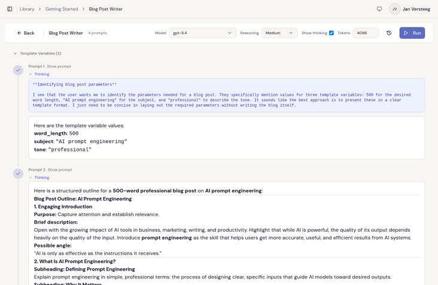

<p align="center">
  
</p>

<h1 align="center">Clarive</h1>

<p align="center">
  <strong>Prompt management for teams that ship.</strong>
</p>

<p align="center">
  <a href="https://github.com/pinkroosterai/Clarive/stargazers"></a>
  <a href="https://github.com/pinkroosterai/Clarive/actions/workflows/ci.yml"></a>
  <a href="https://github.com/pinkroosterai/Clarive/releases"></a>
  <a href="LICENSE"></a>
  <a href="https://hub.docker.com/r/pinkrooster/clarive"></a>
</p>

<p align="center">
  Version control, AI refinement, quality scoring, and team workspaces for your LLM prompts.<br />
  Self-hosted. Single container. MIT licensed.
</p>

<p align="center">
  
</p>

---

## The Problem

Your prompts are scattered. Some live in the codebase, a few in Notion, the rest in someone's Slack messages and a spreadsheet that hasn't been updated since October.

When a prompt change breaks production, there's no version to roll back to. When a non-technical teammate wants to tweak wording, they file a ticket and wait for a deploy. Nobody can tell you whether last week's "small improvement" actually made things better or worse.

Clarive treats prompts like code: versioned, scored, collaboratively edited, and retrievable through an API. Your whole team can use it without learning Git.

---

## Deploy in 60 Seconds

```bash
cp .env.example .env
# Fill in the 3 secrets (generation commands are in the file)
docker compose up -d
```

Open **http://localhost:8080** and create your first account.

> Pulls the pre-built image from [Docker Hub](https://hub.docker.com/r/pinkrooster/clarive). To build from source, see the [development setup guide](docs/development-setup.md).

---

## Features

### AI That Actually Iterates on Your Prompts

<p align="center">
  
</p>

This isn't one-shot "generate a prompt." Clarive runs a multi-turn conversation with AI agents that keep refining until the output is genuinely good.

You describe what you need, review AI-generated variations, ask follow-up questions, and watch the quality score change with each round so you know whether your edits actually helped. Behind the scenes, Tavily web search pulls real-time context into generation, and the system can auto-generate system messages or break a monolithic prompt into a multi-step chain.

Works with any OpenAI-compatible API: OpenAI, Anthropic (via proxy), Azure, local models, whatever you've got.

### Prompt Playground

<p align="center">
  
</p>

Test prompts against any configured model without leaving the app. Responses stream token-by-token. Fill in `{{variables}}`, pick a model, tweak temperature and max tokens, then fire.

For reasoning models (o1, o3, etc.), you get the chain-of-thought alongside the answer. Multi-prompt entries show a step-by-step chain view. Run history keeps your last 20 executions for side-by-side comparison.

### Version Control

Every prompt moves through **Draft → Published → Historical**. You get the rigor of code versioning without the Git overhead.

- Word-by-word, color-coded diffs between any two versions
- One-click rollback to any previous version
- Undo/redo with snapshot history
- Concurrency protection: two people editing the same prompt won't silently overwrite each other

### Rich Editor

<p align="center">
  
</p>

WYSIWYG Markdown editor built on Tiptap v3. Template variables (`{{like_this}}`) get highlighted inline as you type. Entries can hold multiple prompts with drag-and-drop reordering, plus a dedicated system message section.

### Share Links

Share any published prompt with a single URL — no account required. Optionally add a password or an expiration date. Recipients see a clean, read-only page with the prompt content and a one-click copy button. You can copy the link again later, regenerate it (invalidates the old URL), or revoke it entirely from the **Manage Share Link** dialog.

### Teams & Workspaces

<p align="center">
  
</p>

Roles (Admin, Editor, Viewer), multiple workspaces per account, email invitations, and a full audit log. Organize with nested folders, tags (AND/OR filtering), favorites, and full-text search.

### Self-Hosted, No Strings

One container. One command. One port.

nginx + the .NET API, managed by supervisor, all on port 8080. PostgreSQL runs on your infrastructure. MIT licensed with no open-core traps and no enterprise keys gating features you need.

---

## How Clarive Compares

| Feature | Clarive | Langfuse | PromptLayer | Agenta |
|---|:---:|:---:|:---:|:---:|
| Prompt versioning | Yes | Yes | Yes | Yes |
| Multi-turn AI refinement | Yes | — | — | — |
| Quality scoring with history | Yes | — | — | — |
| Web search in generation | Yes | — | — | — |
| Rich WYSIWYG editor | Yes | — | Yes | — |
| Chain decomposition | Yes | — | — | — |
| Interactive playground | Yes | Yes | Yes | Yes |
| Self-hosted (single container) | Yes | Yes (complex) | — | Yes |
| Team RBAC & audit logs | Yes | Paid | Paid | Paid |
| Public share links | Yes | — | — | — |
| Public REST API | Yes | Yes | Yes | Yes |
| MIT license | Yes | MIT (EE) | — | MIT (EE) |
| LLM observability / tracing | — | Yes | Yes | Yes |

Clarive focuses on **prompt authoring, refinement, and team management**. If you need LLM observability and tracing, something like Langfuse pairs well with it.

---

## Architecture

One container: nginx serves the frontend and proxies `/api/` to the .NET backend. PostgreSQL and Valkey run as separate Docker services.

```
               :8080 (nginx)
┌─────────────────────────────────┐     ┌──────────────┐
│         Clarive Container       │     │  PostgreSQL   │
│  ┌──────────┐   ┌────────────┐  │────▶│     16        │
│  │  nginx   │──▶│ .NET 10 API│  │     └──────────────┘
│  │ (frontend)│  │ (backend)  │  │
│  └──────────┘   └────────────┘  │────▶┌──────────────┐
│         supervisor              │     │   Valkey 8   │
└─────────────────────────────────┘     │   (cache)    │
                                        └──────────────┘
```

For the full tech stack, project structure, and design details, see [docs/architecture.md](docs/architecture.md).

---

## Getting Started

You need [Docker](https://docs.docker.com/get-docker/) with Compose v2. That's it.

```bash
cp .env.example .env
# Generate and fill in the 3 secrets (commands are in the file)
docker compose up -d
```

Open **http://localhost:8080**. Frontend and API both run through that single port.

Want a specific version? Set `CLARIVE_VERSION` in `.env` (e.g., `CLARIVE_VERSION=1.0.0`). Default is `latest`.

### What's Next After Deploy

1. **Create your account** at the login screen. The first user becomes the super admin.
2. **Set up AI** (optional): Go to **Super Admin > AI > Providers**, add your OpenAI-compatible provider with an API key, then select default models in **AI > Settings**.
3. **Invite your team**: **Settings > Members > Invite**. Assign Admin, Editor, or Viewer roles.
4. **Create your first prompt**: Hit "New Entry" in the library, start writing, and publish when ready.

### Email (optional)

Email is off by default. Clarive works fine without it — new users are auto-verified. If you want verification emails, password resets, and invitations delivered by email, configure it in **Super Admin > Settings > Email**:

- **Resend** — paste your [Resend](https://resend.com) API key
- **SMTP** — point it at any SMTP server

No restart needed. Changes take effect within 30 seconds.

### Google Login (optional)

Add your Google OAuth client ID and secret in **Super Admin > Settings > Authentication**. The Google sign-in button appears automatically.

---

## Configuration

Your `.env` file only needs three secrets. Everything else is configured through the **Super Admin dashboard** after deploy.

### Environment variables (`.env`)

| Variable | What | Required |
|---|---|---|
| `POSTGRES_PASSWORD` | Database password | Yes |
| `JWT_SECRET` | JWT signing key (min 32 chars) | Yes |
| `CONFIG_ENCRYPTION_KEY` | Encrypts secrets stored in the database | Yes |
| `CORS_ORIGINS` | Allowed CORS origin (your URL) | No (default: `http://localhost:8080`) |
| `CLARIVE_PORT` | Host port | No (default: `8080`) |
| `CLARIVE_VERSION` | Docker Hub image tag | No (default: `latest`) |

### Dashboard settings (Super Admin > Settings)

After your first login, everything else is configurable at runtime — no restart needed:

- **AI**: Add providers, pick default/premium models, set a Tavily API key for web search
- **Email**: Choose provider (`none`, `resend`, `smtp`), configure SMTP credentials or Resend API key
- **Google Login**: Set your Google OAuth client ID and secret
- **Registration**: Toggle whether new users can sign up
- **Rate limits**: Adjust auth endpoint throttling

Full reference: [docs/configuration.md](docs/configuration.md).

---

## API

Clarive has a public API for pulling prompts into your apps. Authenticate with an API key (`X-Api-Key` header), generated from **Settings > API Keys** in the UI.

```bash
# Get a published prompt
curl -H "X-Api-Key: cl_your_key_here" \
  http://localhost:8080/public/v1/entries/{entryId}

# Render with template variables
curl -X POST \
  -H "X-Api-Key: cl_your_key_here" \
  -H "Content-Type: application/json" \
  -d '{"fields": {"topic": "AI safety", "tone": "professional"}}' \
  http://localhost:8080/public/v1/entries/{entryId}/generate
```

The first call returns the published version with its system message and prompts. The second substitutes `{{topic}}` and `{{tone}}` and returns the rendered result.

Full OpenAPI spec: [`docs/api-reference.yaml`](docs/api-reference.yaml). Browse it interactively at `/api-docs` when running in development mode.

---

## Contributing

We'd love the help. The basics:

1. Fork and branch
2. `make setup && make dev` — everything runs in Docker
3. Make changes, add tests
4. `make test && make lint`
5. Open a PR

Full guide with testing details, code conventions, and project structure: [docs/contributing.md](docs/contributing.md). Development environment setup: [docs/development-setup.md](docs/development-setup.md).

Looking for somewhere to start? Check [good first issues](https://github.com/pinkroosterai/Clarive/labels/good%20first%20issue).

## Community & Support

- [GitHub Issues](https://github.com/pinkroosterai/Clarive/issues) — bugs and feature requests
- [GitHub Discussions](https://github.com/pinkroosterai/Clarive/discussions) — questions, ideas, general chat

## Star History

<a href="https://star-history.com/#pinkroosterai/Clarive&Date">
 <picture>
   <source media="(prefers-color-scheme: dark)" srcset="https://api.star-history.com/svg?repos=pinkroosterai/Clarive&type=Date&theme=dark" />
   <source media="(prefers-color-scheme: light)" srcset="https://api.star-history.com/svg?repos=pinkroosterai/Clarive&type=Date" />
   
 </picture>
</a>

## License

[MIT](LICENSE)
