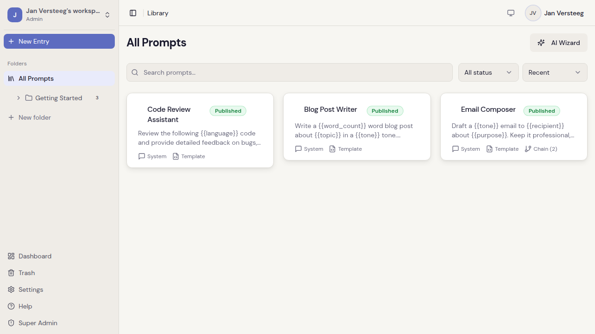
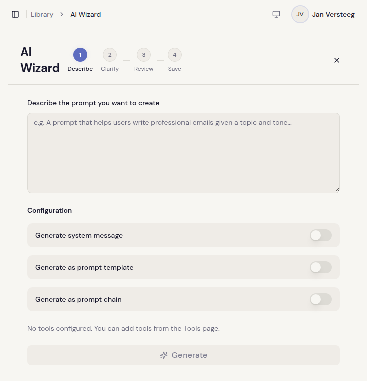
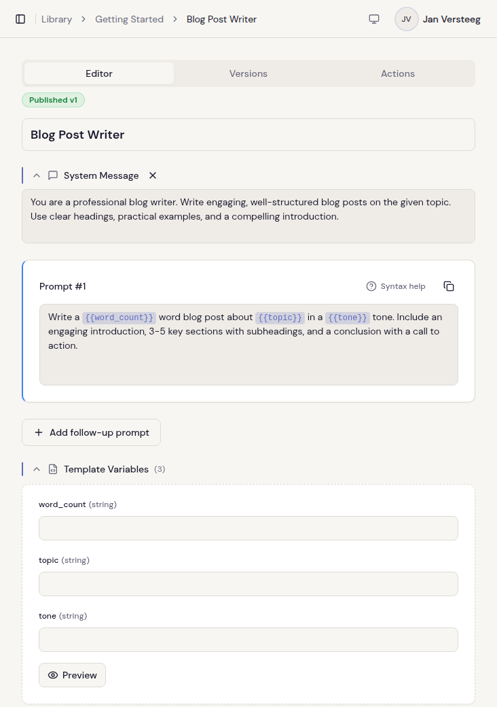
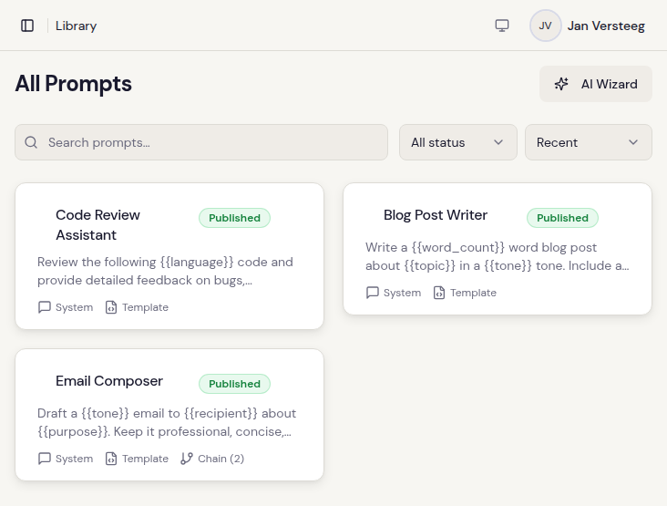

<p align="center">
  
</p>

<h1 align="center">Clarive</h1>

<p align="center">
  <strong>Prompt management for teams that ship.</strong>
</p>

<p align="center">
  <a href="https://github.com/pinkroosterai/Clarive/stargazers"></a>
  <a href="https://github.com/pinkroosterai/Clarive/actions/workflows/ci.yml"></a>
  <a href="https://github.com/pinkroosterai/Clarive/releases"></a>
  <a href="LICENSE"></a>
  <a href="https://hub.docker.com/r/pinkrooster/clarive"></a>
</p>

<p align="center">
  Version control, AI-powered refinement, quality scoring, and team workspaces for your LLM prompts.<br />
  Self-hosted. Single container. MIT licensed.
</p>

<p align="center">
  
</p>

---

## The Problem

If you're building with LLMs, your prompts are probably scattered across your codebase, a few Notion docs, someone's Slack messages, and a spreadsheet that hasn't been updated since October.

When a prompt change breaks production, there's no version to roll back to. When a non-technical teammate wants to tweak wording, they file a ticket and wait for a deploy. And nobody can tell you whether last week's "small improvement" actually made things better or worse.

Clarive treats prompts like code: versioned, scored, collaboratively edited, and retrievable through an API — without requiring your whole team to learn Git.

---

## Deploy in 60 Seconds

```bash
cp .env.example .env
# Fill in the 3 secrets (generation commands are in the file)
docker compose up -d
```

Open **http://localhost:8080** and create your first account.

> This pulls the pre-built image from [Docker Hub](https://hub.docker.com/r/pinkrooster/clarive). To build from source, see [Getting Started](#build-from-source).

---

## Table of Contents

- [Features](#features)
- [How Clarive Compares](#how-clarive-compares)
- [Architecture](#architecture)
- [Getting Started](#getting-started)
- [Configuration](#configuration)
- [Contributing](#contributing)
- [Community & Support](#community--support)
- [Star History](#star-history)
- [License](#license)

## Features

### AI-Powered Prompt Refinement

<p align="center">
  
</p>

This isn't one-shot "generate a prompt" — Clarive runs a multi-turn conversation with AI agents that iterate on your prompts until they're actually good.

- **Generation wizard**: Describe what you need, review AI-generated variations, refine through follow-ups
- **Quality scoring**: Track how a prompt's score changes across refinement rounds — so you know if your edits helped
- **Web search integration**: Tavily-powered research pulls real-time context into generation
- **System message generation**: Auto-generate system prompts from your content
- **Chain decomposition**: Split monolithic prompts into multi-step workflows

### Version Control for Prompts

Every prompt moves through **Draft → Published → Historical** states. You get the rigor of code versioning without the Git overhead.

- Inline diffs — word-by-word, color-coded comparisons between versions
- Undo/redo with snapshot history
- Roll back to any previous version in one click
- Optimistic concurrency protection (two people editing the same prompt won't silently overwrite each other)

### Rich Editor

<p align="center">
  
</p>

- WYSIWYG Markdown editor built on Tiptap v3
- Template variables (`{{variable}}`) highlighted inline as you type
- Multi-prompt entries with drag-and-drop reordering
- Dedicated system message section

### Team Collaboration

<p align="center">
  
</p>

- Role-based access: Admin, Editor, Viewer
- Multiple workspaces per account
- Email invitations with role assignment
- Audit log — who changed what, when
- Tag-based organization with AND/OR filtering

### Developer API

- REST API with OpenAPI spec at `/api-docs`
- API key auth via `X-Api-Key` header
- Import/export in JSON, YAML, and Markdown
- Rate limiting and structured error codes

### Self-Hosted

- **One container** — nginx + .NET API managed by supervisor, all on port 8080
- **One command** — `docker compose up -d`
- **MIT licensed** — no open-core traps, no enterprise keys for features you need
- **Your data** — PostgreSQL running on your infrastructure, not ours

---

## How Clarive Compares

| Feature | Clarive | Langfuse | PromptLayer | Agenta |
|---|:---:|:---:|:---:|:---:|
| Prompt versioning | Yes | Yes | Yes | Yes |
| Multi-turn AI refinement | Yes | — | — | — |
| Quality scoring with history | Yes | — | — | — |
| Web search-backed generation | Yes | — | — | — |
| Rich WYSIWYG editor | Yes | — | Yes | — |
| Chain decomposition | Yes | — | — | — |
| Self-hosted (single container) | Yes | Yes (complex) | — | Yes |
| Team RBAC & audit logs | Yes | Paid | Paid | Paid |
| Public REST API | Yes | Yes | Yes | Yes |
| MIT license | Yes | MIT (EE) | — | MIT (EE) |
| LLM observability / tracing | — | Yes | Yes | Yes |

Clarive focuses on **prompt authoring, refinement, and team management**. If you need LLM observability and tracing, tools like Langfuse pair well with it.

---

## Architecture

Single container: nginx serves the React frontend and proxies `/api/` to the .NET backend. Supervisor manages both processes.

```
               :8080 (nginx)
┌─────────────────────────────────┐     ┌──────────────┐
│         Clarive Container       │     │  PostgreSQL   │
│  ┌──────────┐   ┌────────────┐  │────▶│     16        │
│  │  nginx   │──▶│ .NET 10 API│  │     │               │
│  │ (frontend)│  │ (backend)  │  │     └──────────────┘
│  └──────────┘   └────────────┘  │
│         supervisor              │
└─────────────────────────────────┘
```

<details>
<summary><strong>Tech Stack</strong></summary>

| Layer | Technology |
|---|---|
| Frontend | React 18, TypeScript, Vite, Tailwind CSS, shadcn/ui, Tiptap v3 |
| State | Zustand (auth), TanStack React Query (server state) |
| Backend | C# ASP.NET Core 10 Minimal APIs |
| Database | PostgreSQL 16 via EF Core 10 (Npgsql) |
| Auth | JWT (15-min) + rotating refresh tokens (7-day), Google OIDC, API keys |
| AI | OpenAI via Microsoft.Extensions.AI |
| Testing | xUnit + Testcontainers, Vitest, Playwright |
| Infra | Docker Compose, Makefile |

</details>

<details>
<summary><strong>Project Structure</strong></summary>

```
Clarive/
├── src/
│   ├── frontend/          # React 18 + TypeScript + Vite
│   └── backend/           # ASP.NET Core 10 Minimal APIs
├── tests/
│   └── backend/           # xUnit integration + unit tests
├── docs/                  # Architecture, API spec, guides
├── deploy/                # Build-from-source Compose + env template
│   └── unified/           # nginx, supervisord, entrypoint configs
├── scripts/               # Setup, release, and utility scripts
├── Dockerfile             # Multi-stage: production, dev-backend, dev-frontend
├── docker-compose.yml     # Self-host Compose (Docker Hub pull)
├── .env.example           # Self-host env template (3 required secrets)
└── Makefile               # Dev + deploy commands
```

</details>

---

## Getting Started

### Self-Hosting (Docker Hub)

**Prerequisites:** [Docker](https://docs.docker.com/get-docker/) with Docker Compose v2.

```bash
cp .env.example .env
# Generate and fill in the 3 secrets (commands are in the file)
docker compose up -d
```

Open **http://localhost:8080**. Everything — frontend and API — runs through a single port.

Pin a specific version by setting `CLARIVE_VERSION` in `.env` (e.g., `CLARIVE_VERSION=1.0.0`). Default is `latest`.

For AI features, Google OAuth, or email, see [Configuration](#configuration).

### Build from Source

For contributors or custom deployments:

```bash
git clone https://github.com/pinkroosterai/Clarive.git
cd Clarive
make setup    # generates deploy/.env with random secrets
make deploy   # builds unified image and starts the stack
```

Uses `deploy/docker-compose.yml` which builds from the root `Dockerfile`. Edit `deploy/.env` for full configuration.

### Local Development

<details>
<summary><strong>Development setup with hot reload</strong></summary>

**Prerequisites:** [Docker](https://docs.docker.com/get-docker/) with Docker Compose v2.

Everything runs in Docker — Vite HMR for the frontend, `dotnet watch` for the backend. No local SDKs needed.

```bash
make setup    # generates .env with dev defaults
make dev      # starts postgres, backend, and frontend with hot reload
```

Open **http://localhost:8080**. The Vite dev server proxies `/api/` to the backend internally.

#### Useful Commands

| Command | Description |
|---|---|
| `make dev` | Start all services with hot reload |
| `make stop` | Stop development services |
| `make restart` | Restart development services |
| `make dev-reset` | Stop, wipe database, and restart fresh |
| `make status` | Show running containers and health |
| `make logs` | Tail development service logs |
| `make build` | Build both projects (local, no Docker) |
| `make build-image` | Build unified production image locally |
| `make test` | Run all tests (frontend + backend) |
| `make test-backend` | Run backend unit + integration tests |
| `make test-frontend` | Run frontend tests (Vitest) |
| `make test-e2e` | Run Playwright E2E tests |
| `make test-filter FILTER=Auth` | Run filtered tests |
| `make lint` | Lint frontend |
| `make db-shell` | Open psql shell |
| `make db-migrate` | Apply EF Core migrations |
| `make db-migration-add NAME=X` | Create a new migration |
| `make db-reset` | Destroy and recreate database volumes |
| `make clean` | Remove build artifacts |
| `make help` | Show all commands |

</details>

## Configuration

Configuration is via environment variables.

- **Self-hosting** (Docker Hub): `.env` (root) — used by `docker compose up`
- **Build from source**: `deploy/.env` — used by `make deploy`

`make setup` generates both files with random secrets.

<details>
<summary><strong>Environment variables reference</strong></summary>

| Variable | Description | Required | Default |
|---|---|---|---|
| `POSTGRES_PASSWORD` | Database password | Yes | — |
| `JWT_SECRET` | JWT signing key (min 32 chars) | Yes | — |
| `CONFIG_ENCRYPTION_KEY` | Encryption key for stored secrets | Yes | — |
| `CORS_ORIGINS` | Allowed CORS origins | No | `http://localhost:8080` |
| `CLARIVE_PORT` | Host port to expose | No | `8080` |
| `CLARIVE_VERSION` | Docker Hub image tag (self-host only) | No | `latest` |
| `GOOGLE_CLIENT_ID` | Google OAuth client ID | No | — |
| `GOOGLE_CLIENT_SECRET` | Google OAuth client secret | No | — |
| `ALLOW_REGISTRATION` | Allow new user registration | No | `true` |
| `EMAIL_PROVIDER` | `none`, `console`, `resend`, or `smtp` | No | `none` |

</details>

See [docs/configuration.md](docs/configuration.md) for the full reference.

## Contributing

1. Fork the repo and create a feature branch
2. Make your changes, add tests
3. Run `make test && make lint`
4. Open a pull request

Looking for a place to start? Check [good first issues](https://github.com/pinkroosterai/Clarive/labels/good%20first%20issue). Bugs and feature requests go in [GitHub Issues](https://github.com/pinkroosterai/Clarive/issues).

## Community & Support

- [GitHub Issues](https://github.com/pinkroosterai/Clarive/issues) — bugs and feature requests
- [GitHub Discussions](https://github.com/pinkroosterai/Clarive/discussions) — questions, ideas, general chat

## Star History

<a href="https://star-history.com/#pinkroosterai/Clarive&Date">
 <picture>
   <source media="(prefers-color-scheme: dark)" srcset="https://api.star-history.com/svg?repos=pinkroosterai/Clarive&type=Date&theme=dark" />
   <source media="(prefers-color-scheme: light)" srcset="https://api.star-history.com/svg?repos=pinkroosterai/Clarive&type=Date" />
   
 </picture>
</a>

## License

[MIT](LICENSE)
